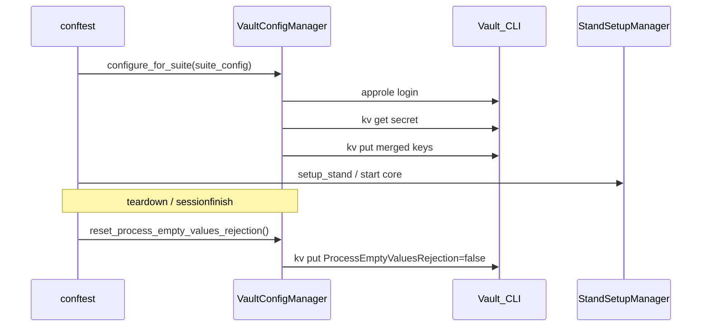

# Интеграция Vault: ProcessEmptyValuesRejection

## Контекст и требования

| Сценарий | Значение `ProcessEmptyValuesRejection` |
|----------|----------------------------------------|
| Запуск [`is_rejected_regress`](test_config/datasets/is_rejected_regress.py) | `"true"` (строка) |
| Завершение набора отбраковки | `"false"` |
| Любой другой dataset перед стартом тестов | `"false"` (принудительно) |

**Секрет Vault** (уточнено по ручной проверке):

- Mount KV v2: `dotnet`
- Относительный путь (без mount): `config/{Environment}/481/{STAND_NAME}/LayerBuilderReportInfoHandler`
- Внутренний путь Vault: `dotnet/data/config/{Environment}/481/{STAND_NAME}/LayerBuilderReportInfoHandler`
- CLI get: `vault kv get -mount=dotnet config/Testing/481/test2/LayerBuilderReportInfoHandler`
- Данные секрета (пример): `ProcessEmptyValuesRejection=false`, `RowsCountLimit=100000`
- При записи **сохранять остальные ключи** (read-merge-write), не затирать `RowsCountLimit`

**Определение `{Environment}` по `STAND_NAME`** (обязательная env из GitLab CI):

| Условие в `STAND_NAME` | Фрагмент пути |
|------------------------|---------------|
| подстрока `test` (case-insensitive) | `Testing` |
| подстрока `dev` (case-insensitive) | `Development` |
| иначе | **ошибка**: «Неизвестный STAND_NAME, невозможно определить path для настроек Vault» |

Примеры (стенды из [`HOST_MAP`](constants/architecture_constants.py)):
- `STAND_NAME=test2` → `config/Testing/481/test2/LayerBuilderReportInfoHandler`
- `STAND_NAME=test4` → `config/Testing/481/test4/LayerBuilderReportInfoHandler`
- `STAND_NAME=dev1` → `config/Development/481/dev1/LayerBuilderReportInfoHandler`

**AppRole** (проверено вручную):
```bash
vault write auth/approle/login role_id=<ROLE_ID> secret_id=<SECRET_ID>
export VAULT_TOKEN=<token>   # role: lds-autotests, ttl 24h
vault kv get -mount=dotnet config/Testing/481/test2/LayerBuilderReportInfoHandler
```

**Уже готово в CI:** `VAULT_ADDR`, `ROLE_ID`, `SECRET_ID`, `STAND_NAME`, бинарник `vault` в образе pytest-runner.

## Архитектура



Точка вызова — **до** `stand_manager.setup_stand_for_imitator_run()` в [`conftest.py`](conftest.py) (`pytest_runtest_setup`), чтобы LDS core поднялся уже с нужной конфигурацией.

## 1. Константы и env-ключи

Файл: [`constants/architecture_constants.py`](constants/architecture_constants.py)

Добавить `VaultConstants` (переиспользовать `EnvKeyConstants.STAND_NAME`, уже есть):

```python
class VaultConstants:
    VAULT_ADDR = "VAULT_ADDR"
    ROLE_ID = "ROLE_ID"
    SECRET_ID = "SECRET_ID"
    VAULT_SKIP_VERIFY = "VAULT_SKIP_VERIFY"  # optional, default true для self-signed

    KV_MOUNT = "dotnet"
    SECRET_PATH_TEMPLATE = "config/{environment}/481/{stand_name}/LayerBuilderReportInfoHandler"
    ENVIRONMENT_TESTING = "Testing"
    ENVIRONMENT_DEVELOPMENT = "Development"
    PROCESS_EMPTY_VALUES_REJECTION_KEY = "ProcessEmptyValuesRejection"
    VAULT_CMD_TIMEOUT_S = 30
```

**Построение пути** — два метода в `VaultConfigManager`:

`_resolve_environment(stand_name: str) -> str`:
1. `stand_lower = stand_name.lower()`
2. если `"test" in stand_lower` → `"Testing"`
3. elif `"dev" in stand_lower` → `"Development"`
4. else → `ValueError("Неизвестный STAND_NAME='...', невозможно определить path для настроек Vault")`

`_resolve_secret_path() -> str`:
1. Прочитать `STAND_NAME` из env (обязательна)
2. Вычислить `environment = _resolve_environment(stand_name)`
3. Вернуть `SECRET_PATH_TEMPLATE.format(environment=environment, stand_name=stand_name)`

Whitelist `ALLOWED_STAND_NAMES` **не используем** — достаточно правила по подстроке + наличие стенда в `HOST_MAP` не проверяем (Vault path может существовать независимо).

## 2. VaultConfigManager

Новый файл: [`infra/vault_config_manager.py`](infra/vault_config_manager.py)

Отдельный менеджер (не `SubprocessClient` — vault вызывается **локально** в CI-контейнере, без SSH):

| Метод | Назначение |
|-------|------------|
| `_resolve_environment(stand_name) -> str` | `Testing` / `Development` по подстроке в `STAND_NAME` |
| `_resolve_secret_path() -> str` | Относительный путь секрета без mount |
| `is_configured() -> bool` | Проверка `VAULT_ADDR`, `ROLE_ID`, `SECRET_ID`, `STAND_NAME` + успешный `_resolve_environment` |
| `_login_approle() -> None` | `vault write auth/approle/login role_id=... secret_id=... -format=json` → `VAULT_TOKEN` в env процесса |
| `_run_vault_cmd(args) -> str` | `subprocess.run(["vault", ...])` локально, таймаут, лог без секретов |
| `get_secret_data() -> dict[str, str]` | `vault kv get -mount=dotnet -format=json <path>` → парсинг KV v2: `response["data"]["data"]` |
| `set_process_empty_values_rejection(enabled: bool) -> None` | read → merge → `vault kv put -mount=dotnet <path> Key=Value ...` |
| `ensure_disabled() -> None` | alias для `set_process_empty_values_rejection(False)` |

**Важные детали реализации:**
- Все kv-команды с `-mount=dotnet` (не полный путь `dotnet/data/...`)
- Значения `ProcessEmptyValuesRejection` писать как `"true"` / `"false"` (строки); при чтении нормализовать bool/string
- При merge не удалять существующие ключи (`RowsCountLimit` и др.)
- Ошибки Vault → `RuntimeError` с понятным текстом (без ROLE_ID/SECRET_ID/TOKEN в логах)
- `VAULT_SKIP_VERIFY=true` в env subprocess, если переменная не задана
- Кэшировать `VAULT_TOKEN` в экземпляре менеджера на время сессии pytest (ttl 24h); повторный login не нужен на каждый suite

## 3. Флаг в конфиге набора отбраковки

Файл: [`test_config/models_for_tests.py`](test_config/models_for_tests.py)

В `IsRejectedConfig` добавить поле:

```python
requires_process_empty_values_rejection: bool = False
```

Файл: [`test_config/datasets/is_rejected_regress.py`](test_config/datasets/is_rejected_regress.py)

```python
requires_process_empty_values_rejection=True,
```

Так conftest не завязан на имя suite-строкой; будущие rejection-наборы смогут явно включать флаг.

## 4. Интеграция в conftest.py

Файл: [`conftest.py`](conftest.py)

### 4.1 Хелперы (рядом с `_run_lds_configurator_teardown_if_needed`)

```python
def _configure_vault_for_suite(suite_config, cfg: dict) -> None:
    manager = VaultConfigManager()
    if not manager.is_configured():
        if suite_config and getattr(suite_config, "requires_process_empty_values_rejection", False):
            _skip_current_suite_after_setup_failure(cfg, "[SETUP] [ERROR] Vault не настроен для набора отбраковки")
        logger.warning("[SETUP] [SKIP] Vault credentials не заданы — ProcessEmptyValuesRejection не изменён")
        return
    enabled = bool(getattr(suite_config, "requires_process_empty_values_rejection", False))
    manager.set_process_empty_values_rejection(enabled)
    cfg["vault_rejection_enabled"] = enabled

def _reset_vault_process_empty_values_rejection(cfg: dict) -> None:
    ...
```

### 4.2 `pytest_runtest_setup` — при смене suite

После определения `suite_config`, **до** `StandSetupManager(...)`:

```python
try:
    _configure_vault_for_suite(suite_config, cfg)
except Exception as error:
    _skip_current_suite_after_setup_failure(cfg, f"[SETUP] [ERROR] Vault: {error}")
```

Логика значения:
- `requires_process_empty_values_rejection=True` → `"true"`
- иначе → `"false"` (все smoke/lds_status/прочие наборы)

### 4.3 `pytest_runtest_teardown` — выход из rejection-набора

Когда `next_suite != cfg["current_suite"]` и `cfg.get("vault_rejection_enabled")`:
- вызвать `_reset_vault_process_empty_values_rejection(cfg)` (best-effort, ошибки — `[TEARDOWN] [ALERT]` как у LDS configurator)
- сбросить `cfg["vault_rejection_enabled"] = False`

### 4.4 `pytest_sessionfinish` — safety net

Если `vault_rejection_enabled` всё ещё True (упали посередине, не было teardown) — принудительно `"false"`.

### 4.5 `group_state`

Добавить ключи: `vault_rejection_enabled: bool`.

## 5. Ограничения среды (.cursor/rules)

По [`global-guard.mdc`](.cursor/rules/global-guard.mdc):
- Код пишем без запуска `vault`/pytest в песочнице агента
- Проверка — на CI или вручную в образе: `pytest tests/test_is_rejected_regress.py --suites=is_rejected_regress`

## Риски и митигация

| Риск | Митигация |
|------|-----------|
| Неверный `STAND_NAME` (нет `test`/`dev`) | `_resolve_environment()` → `ValueError`; для rejection-набора — skip setup |
| Отсутствующий `STAND_NAME` | `is_configured()` = False / `ValueError`; skip или fail по типу набора |
| Падение между setup и teardown оставляет `true` | `pytest_sessionfinish` + reset при смене suite |
| Отсутствие Vault локально | Skip с warning для обычных наборов; fail/skip для rejection |

## Объём изменений

| Файл | Действие |
|------|----------|
| `infra/vault_config_manager.py` | создать |
| `constants/architecture_constants.py` | env + path constants |
| `test_config/models_for_tests.py` | флаг в `IsRejectedConfig` |
| `test_config/datasets/is_rejected_regress.py` | `requires_process_empty_values_rejection=True` |
| `conftest.py` | setup/teardown/sessionfinish hooks |

Документацию в `docs/` **не обновляем**.

Тесты на автотесты **не добавляем** (по вашим правилам); верификация — прогон `is_rejected_regress` на CI + smoke-набор для проверки принудительного `false`.
